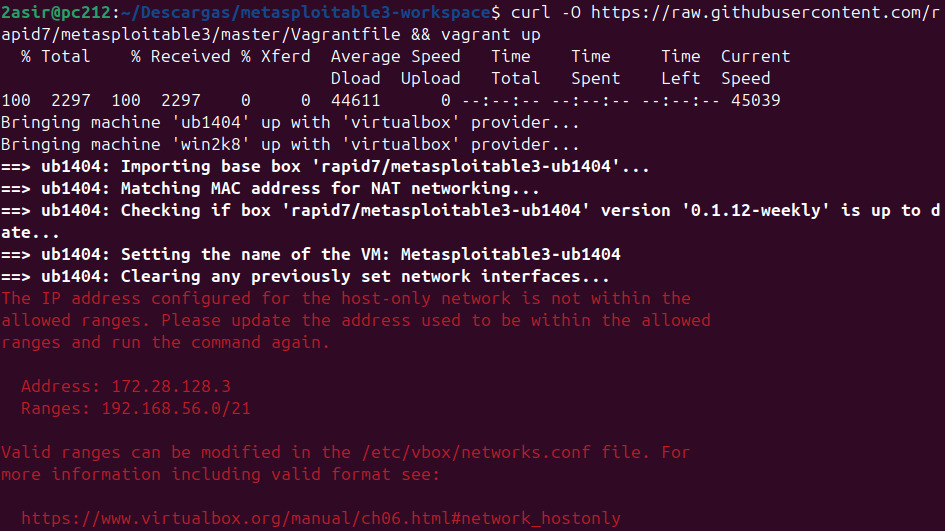
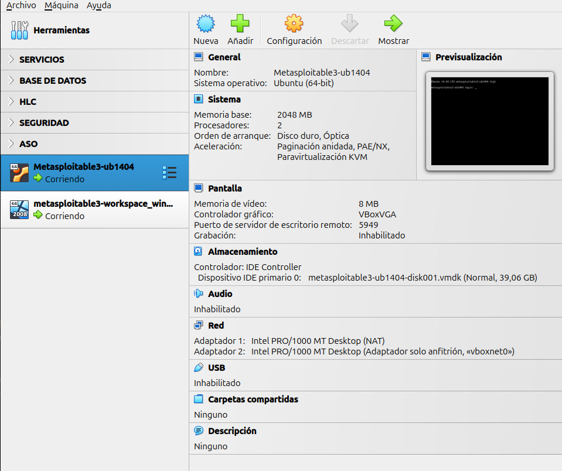

# Instalación de Metasploitable 3 en Ubuntu 24.04
## [English](https://github.com/JesusGonzalezAragon/metasploitable3-installation)

---
### Inicio
Para usar Metasploitable 3, vamos a necesitar hacer primero un par de cosas:
* [Instalar Vagrant](https://developer.hashicorp.com/vagrant/install?product_intent=vagrant) 
* Crear un archivo de configuración en /etc/vbox
* Virtualbox 7.0 o inferior (Virtualbox 7.1 no es soportado)

> Podemos usar otros hipervisores soportados como VMware y Hyper-V.

### Instalar Vagrant
Empecemos entrando en el enlace anterior de [Vagrant](https://developer.hashicorp.com/vagrant/install?product_intent=vagrant), como podemos ver si
bajamos un poco, encontramos la opción de Linux.

```shell
wget -O- https://apt.releases.hashicorp.com/gpg| sudo gpg --dearmor -o /usr/share/keyrings/hashicorp-archive-keyring.gpg

echo "deb [signed-by=/usr/share/keyrings/hashicorp-archive-keyring.gpg] https://apt.releases.hashicorp.com $(lsb_release -cs) main" | sudo tee /etc/apt/sources.list.d/hashicorp.list

sudo apt update && sudo apt install vagrant
```

Ahora, creamos el directorio de [Metasploitable 3](https://github.com/rapid7/metasploitable3)
```shell
mkdir metasploitable3-workspace
```

Proseguimos entrando en el directorio y descargando los archivos con curl:
```shell
cd metasploitable3-workspace

curl -O https://raw.githubusercontent.com/rapid7/metasploitable3/master/Vagrantfile && vagrant up
```

### Error de VirtualBox

Muy probablemente os salga el mismo error, pues no hemos configurado el archivo que va en **/etc/vbox**. Nos dice que la dirección IP configurada para el host no está dentro de los rangos permitidos, pues vamos a hacer que sí lo estén.

> Primero tenemos que crear la ruta **/etc/vbox** con el archivo networks.conf, pues no están por defecto ni el directorio no el archivo.

```shell
sudo mkdir /etc/vbox
sudo nano /etc/vbox/networks.conf
```

Para permitir el rango, en este caso la **red 172.28.0.0/16** (Para evitarnos problemas, ya que podríamos permitir solo la IP).

Introducimos lo siguiente en el archivo /etc/vbox/networks.conf:

```
* 172.28.0.0/16
* 192.168.56.0/24
```

> La 192.168.56.0 es la red para la máquina Windows, si no lo añadimos, nos dará otro error al hacer`vagrant up`
> >**¡OJO! He cogido el rango en base a la dirección que me daba el error de la imagen anterior, también es obligatorio usar el * para indicar el comienzo del rango o la IP que vamos a declarar en el archivo de configuración**.

Y volvemos a hacer un `vagrant up` en el directorio **metasploitable3-workspace**, al hacerlo, nos empezará a importar las máquinas tanto de Linux como de Windows vulnerables en VirtualBox. Al terminar, si vamos a VirtualBox, veremos las 2 máquinas importadas y en ejecución.

### Resultado

El resultado debería ser que tenemos 2 máquinas que no teníamos antes y en estado
*Corriendo*.
